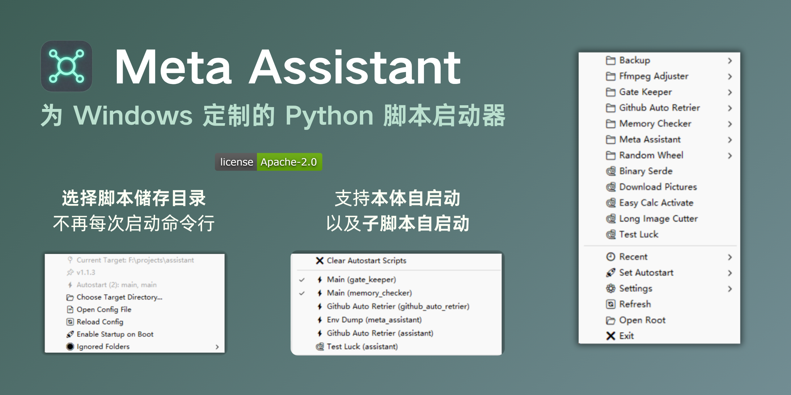

# Meta Assistant

[](https://github.com/cup113/meta_assistant/actions)
[](https://www.python.org)
[](.)
[](https://deepwiki.com/cup113/meta_assistant)

**Meta Assistant** is a Windows system tray application that provides instant access to Python scripts (`.py`/`.pyw`) within a designated project directory. It dynamically builds a hierarchical menu from your file structure, excludes common development folders (like `node_modules`, `venv`, `.git`), tracks recently launched scripts, and offers configuration management—all from a lightweight tray icon.



## Features

- **Dynamic Tray Menu**: Automatically scans and lists all Python scripts in your target directory, preserving folder hierarchy.
- **Package-Aware Scanning**: Detects Python packages (`__init__.py`); packages with `__main__.py` get a "▶ Run" submenu entry (via `python -m`), and `_`-prefixed internal modules are hidden for a cleaner menu.
- **Virtual Environment Detection**: Automatically finds and uses `.venv`/`venv` Python interpreters when launching scripts.
- **Smart Exclusions**: Ignores common non-script directories (`node_modules`, `venv`, `.git`, etc.) with an editable ignore list.
- **Recent Files**: Quick access to the 10 most recently launched scripts.
- **Configuration GUI**: Change target directory, edit `config.json`, manage ignored folders, and refresh the menu without leaving the tray.
- **Auto-start**: Optional Windows autostart when run as a frozen executable.
- **Lightweight**: Minimal resource usage; runs silently in the background.

## Installation

### Prerequisites

- Windows OS
- Python 3.8+ (if running from source)
- Dependencies: `pystray`, `Pillow`

### From Source
1. Clone or download this repository.
2. Install dependencies:
```bash
   pip install -r requirements.txt
```
3. Run the app:
```bash
   python meta_assistant.py
```
### As Standalone Executable
1. Install build dependencies:
```bash
   pip install -r requirements.txt
```
2. Build with Nuitka:
```bash
   python -m nuitka --standalone --windows-console-mode=disable --include-data-files=assistant.ico=./assistant.ico --output-dir=dist --enable-plugin=tk-inter meta_assistant.py
```
3. Use the generated executable in the `dist/meta_assistant.dist/` folder.

## Usage

- **Launch Scripts**: Left-click the tray icon → navigate the menu → click a script to run.
  - `.pyw` files launch with `pythonw` (no console).
  - `.py` files launch in a new console window.
- **Settings**:
  - **Choose Target Directory**: Select a different root folder to scan.
  - **Open Config File**: Edit `config.json` (target, ignore list) manually.
  - **Ignored Folders**: Remove entries from the ignore list via submenu.
  - **Refresh**: Reload files and menu immediately.
- **Recent**: Access recently launched scripts (if they still exist).
- **Set Autostart**: Configure one or more scripts to run automatically when the application starts (via "Set Autostart" submenu). Click to toggle scripts on/off.
- **Open Root**: Open the target directory in File Explorer.
- **Exit**: Quit the application.

## Configuration

Configurations are stored in `%APPDATA%\MetaAssistant\`:

- `config.json`: Sets `target_dir`, `ignore_dirs`, and `autostart_scripts`.
- `assistant_stats.json`: Tracks recent file history.
- `assistant.log`: Runtime logs.

Example `config.json`:

```json
{
  "target_dir": "F:/projects/assistant",
  "ignore_dirs": ["node_modules", "__pycache__", "venv", ".git", ".venv", "dist", "build"],
  "autostart_scripts": ["F:/projects/assistant/startup.py"]
}
```

## Notes

- Paths in `ignore_dirs` are **lowered** folder names (not full paths).
- The app updates the menu automatically when config changes or on manual refresh.
- Auto-start registry key (`HKEY_CURRENT_USER\...\Run`) is set only when running as a compiled `.exe` (not from `python.exe`).
- `autostart_scripts` is an array of absolute paths; each script will be launched when the application starts.

## Troubleshooting

- **Menu not updating**: Use "⚙️ Settings → 🔄 Reload Config" or restart the app.
- **Scripts not appearing**: Check `target_dir` in config and ensure files have `.py`/`.pyw` extensions.
- **Permission issues**: Ensure `%APPDATA%\MetaAssistant\` is writable.
- **Logs**: Check `assistant.log` in the config directory for errors.

## Contributing

Improvements and bug fixes are welcome! Open an issue or submit a pull request.
